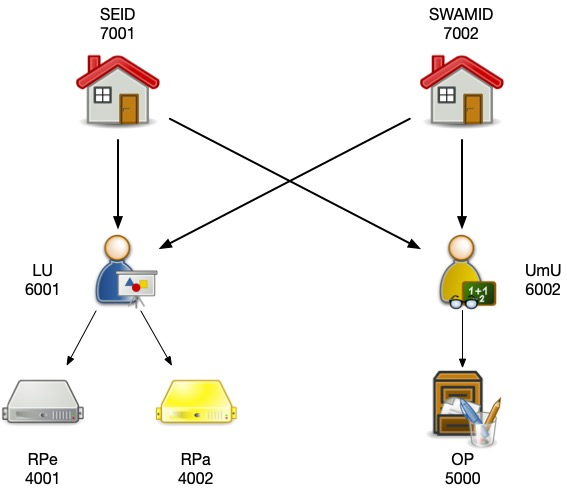

# OIDC federation implementation

[Forked from https://github.com/rohe/fedservice]

## Project structure

- [deps/fedservice](deps/fedservice): Python implementation of OIDC federation
- [app](app): Python (w/ Flask) code to run different federation entities
- [example-conf](example-conf): configuration folder for example federation setup

## Federation example

This repo builds a federation which consists of:

- relying parties:
  - [auto](https://auto.localhost): RP that uses automatic registration
  - [expl](https://expl.localhost): RP that uses explicit registration
- OIDC providers:
  - [op](https://op.localhost)
- intermediate entities:
  - [umu](https://umu.localhost)
  - [lu](https://lu.localhost)
- trust anchors:
  - [seid](https://seid.localhost)
  - [swamid](https://swamid.localhost)

The trust relationships are depicted below:



### Build Docker Image

The docker image is available on [Docker Hub](https://hub.docker.com/r/ddgu/fedservice/). You can pull it with the following command:

```bash
    docker pull ddgu/fedservice
```

However, if you want to build the docker image yourself, you must first retrieve the latest source code for its dependencies. The script `build.sh` will do this for you, and then build the docker image.

```bash
    ./build.sh
```

This will create a directory called `deps` and clone the following repositories into it:

* [fedservice](https://github.com/rohe/fedservice)

It will also apply any necessary patches to the dependencies.

Then it will build the docker image `ddgu/fedservice` and tag it with the current date and time.

### Configure test environment

An example setup is provided in the `example-conf` directory. The `example-conf` directory contains an `entities.json` file and multiple directories, one for each entity type.

The following entity types are supported:

* `op`: openid provider
* `rp`: relying party
* `intermediate`: intermediate entity in a federation
* `ta`: trust anchor

Each entity type directory contains subdirectories, one for each entity, named after the entity and containing the configuration file for that entity, named `config.json`.

The `entities.json` file contains a dictionary of entities, where the key is the entity name and the value is a dictionary containing the following keys:

* `type`: the entity type
* `authority_hints`: a list of authority hints for the entity
* `trust_anchors`: a list of trust anchors for the entity
* `trust_marks` (optional): a dictionary of trust marks for the entity, where the key is the trust mark issuer (its name) and the value is the trust mark (URL).

To configure the test environment, you must run the `configure.sh` script, which will copy the content of `example-conf` to a new folder `conf` and create additional configuration files for each entity, based on the `entities.json` file (such as `authority_hints.json` and `trust_anchors.json`). The script will also create a `caddy` directory, which contains the configuration files for the Caddy web server.

If you are not running the test environment on your local machine, you must also pass the domain name to the `configure.sh` script, and it will first replace the domain name in the configuration files with the domain name of the machine you are running the test environment on.

```bash
    ./configure.sh [<domain>]
```

### Deploy test environment

To deploy the test environment, you only need the `conf` and `caddy` directories, as well as the `docker-compose.yml` file.

```bash
    docker network create caddy
    docker-compose up -d
```

### Testing

All the entities will expose the `/.well-known/openid-federation` endpoint, according to the OIDCfed specification.

You can also display the payload of an entity that has the provided entity id (given by its URL) as follows:

```bash
docker-compose run display https://swamid.localhost
```

If the entity is an intermediate or trust anchor, that is has subordinates, it will also list the subordinates.

## GEANT T&II setup

We have a testbed federation setup at `fedservice.testbed.oidcfed.incubator.geant.org`:

- relying parties:
  - [auto](https://auto.fedservice.testbed.oidcfed.incubator.geant.org): RP that uses automatic registration
  - [expl](https://expl.fedservice.testbed.oidcfed.incubator.geant.org): RP that uses explicit registration
- OIDC providers:
  - [op](https://op.fedservice.testbed.oidcfed.incubator.geant.org)
- intermediate entities:
  - [umu](https://umu.fedservice.testbed.oidcfed.incubator.geant.org)
  - [lu](https://lu.fedservice.testbed.oidcfed.incubator.geant.org)
- trust anchors:
  - [seid](https://seid.fedservice.testbed.oidcfed.incubator.geant.org)
  - [swamid](https://swamid.fedservice.testbed.oidcfed.incubator.geant.org)

The setup uses Let's Encrypt certificates and Docker swarm. The compose file is [here](docker-compose.tii.yml).

You can also display the payload of an entity that has the provided entity id (given by its URL) as follows:

```bash
docker-compose run display https://swamid.fedservice.testbed.oidcfed.incubator.geant.org
```

## Onboarding an entity to an existing federation

As an example, to onboard the OP 'https://op.localhost' to the italian federation (trust anchor 'https://trust-anchor.spid-cie.localhost/'), you need to:

- add the trust anchor to the OP's list of authority hints:

  ```bash
  $ cat conf/op/op/authority_hints.json
  [
    "https://trust-anchor.spid-cie.localhost/",
    "https://umu.localhost"
  ]
  ```

- add the trust anchor to the OP's list of trusted roots, with the corresponding jwks:

  ```bash
  $ cat conf/op/op/trusted_roots.json
  {
    "https://seid.localhost": {
      "keys": [
        ...
      ]
    },
    "https://swamid.localhost": {
      "keys": [
        ...
      ]
    },
    "https://trust-anchor.spid-cie.localhost/": {
      "keys": [
        ...
      ]
    }
  }
  ```

- restart the OP container
  ```bash
  docker-compose restart op
  ```
- onboard the OP to the trust anchor at https://trust-anchor.spid-cie.localhost/onboarding/landing

## Onboarding a new entity in this federation

For example, add an RP as a direct subordinate of the trust anchor 'https://swamid.localhost':

- make sure the entity has configured the trust anchor as an authority hint
- OPTIONAL: add `swamid` as trusted root for the RP, with its corresponding jwks
- onboard it by submitting a POST request to the trust anchor's onboarding endpoint:
  ```bash
  curl -d "sub={RP's entity_id}" -X POST https://swamid.localhost/onboarding
  ```

- ALTERNATIVELY, you can do it manually by:
  - adding the entity as a subordinate of the trust anchor by adding a new file in `conf/ta/swamid/subordinates/{urlencoded_entity_id}`: the file should contain the entity's jwks

  ```bash
  $ cat conf/ta/swamid/subordinates/https%3A%2F%2Fgorp.localhost
  {
    "keys": [
      ...
    ]
  }
  ```
  - restarting the trust anchor container

- if you run the setup locally, you might need to add the new entity name to your /etc/hosts file (e.g. `127.0.0.1 gorp.localhost`), as well as an alias in the traefik network, in `traefik/docker-compose.yml`. Then restart the traefik container.

----

This work was started in and supported by the
[Geant Trust & Identity Incubator](https://connect.geant.org/trust-and-identity-incubator).


